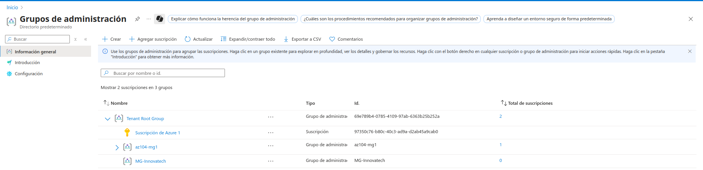
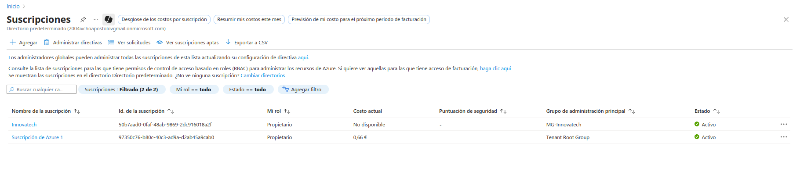
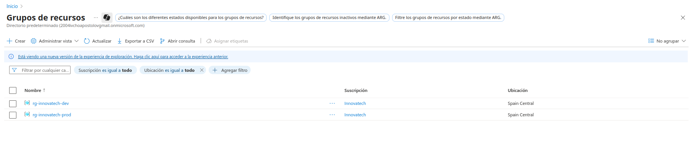
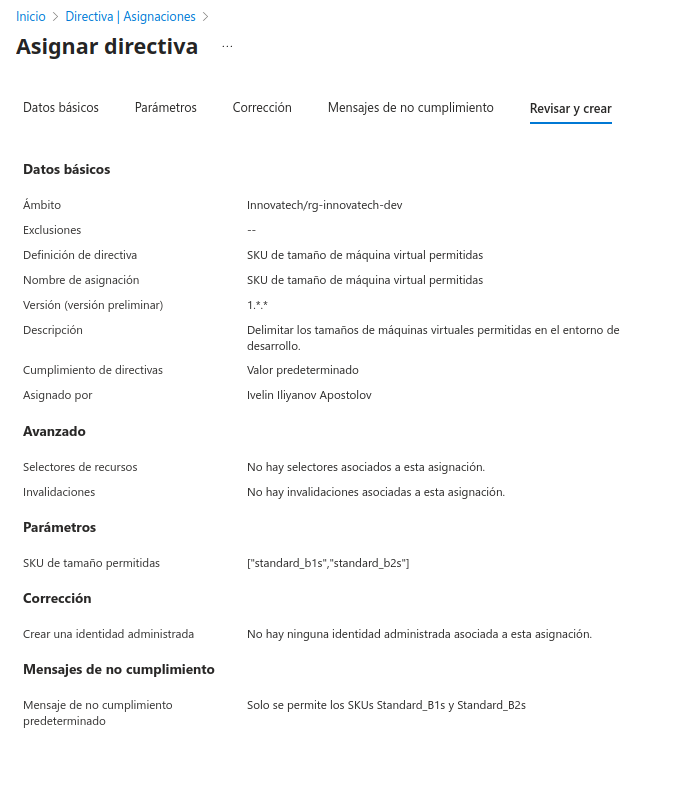
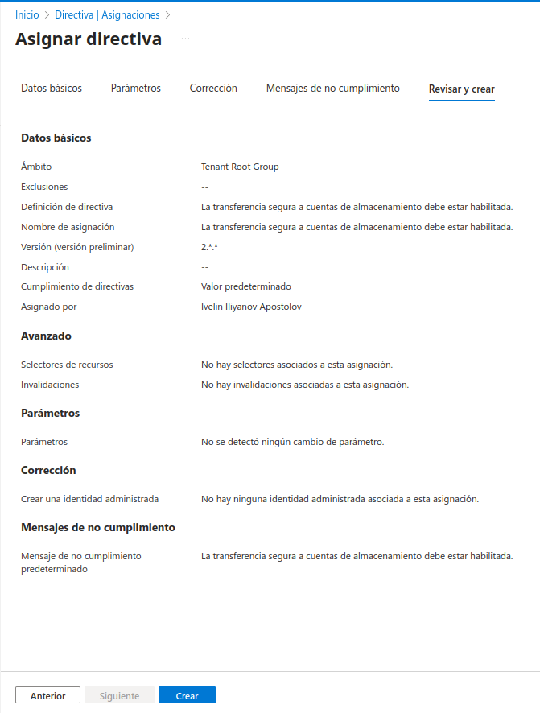
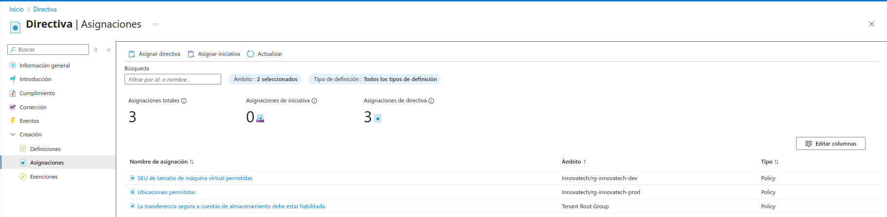
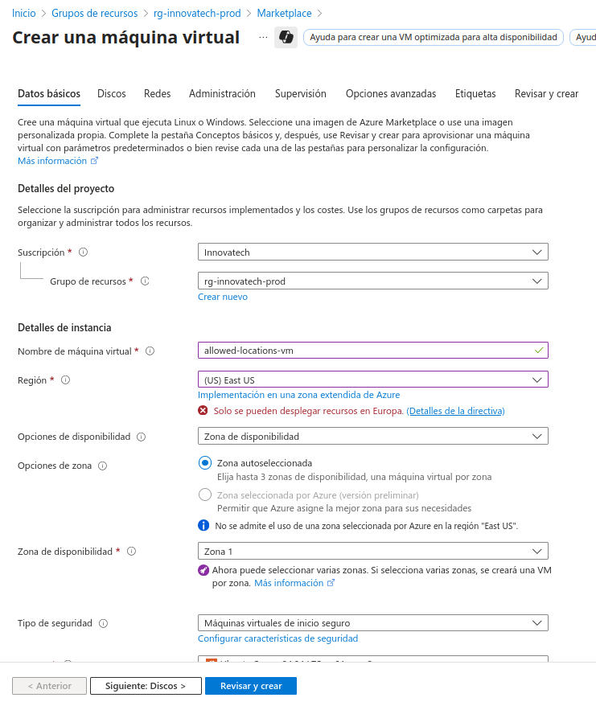
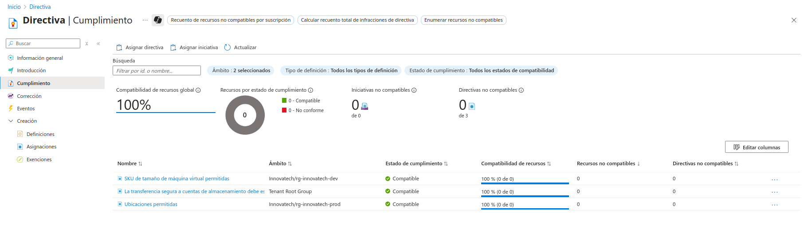
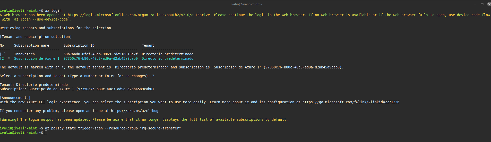
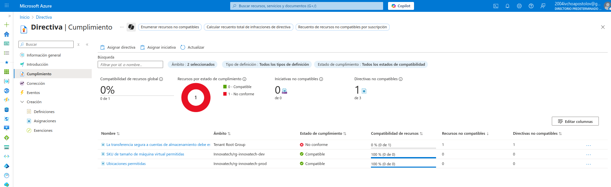

# 📄 Documentación Detallada: Gobierno de Azure a Escala

Este documento narra el proceso completo de implementación de un modelo de gobierno en Azure, explicando las decisiones técnicas y su alineación con los objetivos de negocio.

## 📝 Descripción del Problema

Una empresa ficticia, **"Innovatech Solutions"**, está expandiendo rápidamente su uso de Azure. Su entorno en la nube está creciendo de forma desorganizada, lo que ha generado tres problemas críticos:

1.  **Control de Costes:** Los equipos de desarrollo despliegan máquinas virtuales muy potentes para pruebas, lo que dispara la factura mensual sin control.
2.  **Cumplimiento Normativo:** Para sus clientes en la Unión Europea, necesitan garantizar que los datos de producción nunca abandonen los centros de datos europeos para cumplir con el GDPR.
3.  **Estándares de Seguridad:** No existe una política de seguridad unificada, lo que resulta en la creación de recursos (como cuentas de almacenamiento) con configuraciones inseguras.

## 💡 Solución Propuesta

La solución es diseñar e implementar una estructura de gobierno centralizada utilizando la jerarquía nativa de Azure para resolver estos problemas de raíz. La estrategia consiste en:

1.  **Estructurar la jerarquía** con Management Groups que reflejen la organización de la empresa (Producción vs. Desarrollo).
2.  **Asignar políticas específicas** a cada nivel de la jerarquía para aplicar las reglas de negocio de forma automática.
3.  **Utilizar efectos de política** como `Deny` para bloqueos en tiempo real y `Audit` para la supervisión y reporte de incumplimientos.

## 🛠️ Pasos de la Implementación

A continuación, se detallan los pasos realizados para construir e implementar esta solución.

#### Paso 1: Creación de la Jerarquía (Management Groups)

El primer paso es crear una estructura lógica que represente a la organización. Se crea un Management Group (MG) principal para "Innovatech" y, dentro de él, MGs para los entornos de Producción y Desarrollo. Esto nos permite aplicar políticas distintas a cada entorno.

#### Paso 2: Organización de Suscripciones

Con la jerarquía de MGs creada, se asignan las suscripciones de Azure correspondientes. La suscripción "Innovatech" se moverá al MG "MG-Innovatech", que contendrá los entornos de la empresa.

#### Paso 3: Estructura de Grupos de Recursos

Dentro de la suscripción "Innovatech", se crean dos Grupos de Recursos (RGs) para actuar como contenedores lógicos de los recursos de cada entorno: `rg-innovatech-dev` y `rg-innovatech-prod`.

#### Paso 4: Asignación de Política de Control de Costes (Desarrollo)

Para solucionar el problema de los costes, se asigna la política **"SKU de tamaño de máquina virtual permitidas"** directamente al RG `rg-innovatech-dev`. Se configura para permitir únicamente SKUs de bajo coste (`Standard_B1s`, `Standard_B2s`). El efecto es `Deny`, por lo que bloqueará la creación de cualquier VM fuera de esta lista.

#### Paso 5: Asignación de Política de Cumplimiento (Producción)

Para garantizar el cumplimiento del GDPR, se asigna la política **"Ubicaciones permitidas"** al RG `rg-innovatech-prod`. Se configura para permitir únicamente las regiones del Norte y Oeste de Europa. Esta política también usa el efecto `Deny`.

#### Paso 6: Asignación de Política Global de Seguridad

Para establecer un estándar de seguridad mínimo en toda la organización, se asigna la política **"La transferencia segura a cuentas de almacenamiento debe estar habilitada"** al nivel más alto posible: el **Tenant Root Group**. Esto asegura que cualquier suscripción, presente o futura, herede esta regla. Se elige el efecto `Audit` para reportar incumplimientos sin bloquear el trabajo.

#### Paso 7: Resumen de Políticas Asignadas

Una vez configuradas, el portal de Azure Policy nos ofrece una vista centralizada de todas las asignaciones, sus ámbitos y su estado.

#### Paso 8: Verificación en Tiempo Real de las Políticas `Deny`

La mejor forma de comprobar que las políticas funcionan es intentar violarlas.

Primero, se intenta crear una VM con un SKU no permitido en el entorno de desarrollo. Como se esperaba, el portal bloquea la selección de SKUs caros, mostrando que están "Bloqueado por una directiva".

A continuación, se intenta crear una VM en la región "East US" dentro del grupo de recursos de producción. El portal muestra un error de validación inmediato, indicando que "Solo se pueden desplegar recursos en Europa."

#### Paso 9: Verificación de la Política `Audit`

Se crea intencionadamente un recurso no conforme (una cuenta de almacenamiento con la transferencia segura deshabilitada) para probar la política de `Audit`.

Inicialmente, el panel de cumplimiento muestra un 100% de compatibilidad, ya que el ciclo de evaluación de `Audit` no es instantáneo.

Para acelerar el proceso, se ejecuta un escaneo manual de cumplimiento a través de Azure CLI.

Poco después del escaneo, el panel de cumplimiento se actualiza, mostrando un estado de **"No conforme"** y señalando exactamente qué política y qué recurso están fallando. ¡El sistema de auditoría funciona!

## 🏁 Conclusión: El Valor de un Gobierno Proactivo

Este proyecto demuestra que un modelo de gobierno bien implementado es una de las inversiones más valiosas que una organización puede hacer en su entorno cloud. La capacidad de aplicar directivas a diferentes niveles de la jerarquía —desde el Management Group Raíz hasta Grupos de Recursos específicos— proporciona un control granular y a la vez escalable sobre toda la infraestructura.

Mediante el uso de Azure Policies, una organización puede pasar de un modelo reactivo (corregir errores y brechas de seguridad después de que ocurran) a un **modelo proactivo**, donde las "barandillas" (guardrails) de seguridad, cumplimiento y coste están integradas en la propia plataforma.

Los beneficios directos de este enfoque son:

* **Auditorías Simplificadas:** En lugar de investigar manualmente "quién creó qué y por qué", el estado de cumplimiento es auditable en tiempo real desde un único panel, simplificando drásticamente las revisiones de seguridad y cumplimiento normativo.
* **Reducción de Riesgos y Costes:** Se previene la creación de recursos inseguros o caros *antes* de que ocurra, eliminando el error humano y garantizando que solo se desplieguen configuraciones que se adhieren a las normativas de la empresa.
* **Agilidad y Predictibilidad:** Se establece un marco de trabajo claro y predecible. Los equipos de desarrollo pueden innovar con la confianza de que operan dentro de unos límites seguros y bien definidos, evitando el caos y permitiendo una planificación más efectiva.

En definitiva, una gobernanza bien definida no es un freno para la innovación, sino su principal habilitador, permitiendo a las empresas crecer en la nube de forma segura, ordenada y eficiente.