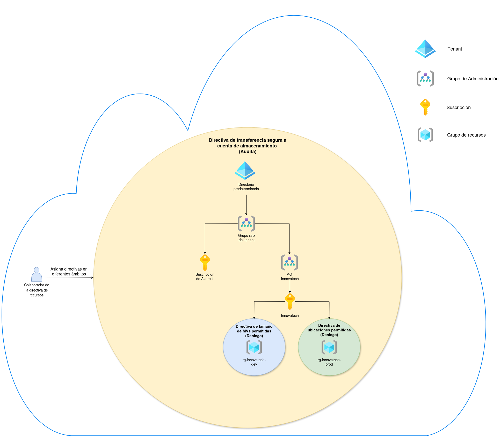

# Gobierno de Azure a Escala con Management Groups y Policies

Este proyecto demuestra la implementación de un modelo de gobierno robusto en Microsoft Azure, diseñado para solucionar problemas críticos de negocio en entornos cloud en crecimiento. A través de una jerarquía de Management Groups y la asignación estratégica de Azure Policies, se establecen barandillas de seguridad, cumplimiento y control de costes de forma proactiva.

## 📖 Contexto del Problema

Una empresa en expansión se enfrenta a tres desafíos comunes en su entorno de Azure:
1.  **Costes Descontrolados:** Falta de control sobre los recursos desplegados en entornos de desarrollo.
2.  **Riesgos de Cumplimiento:** Necesidad de garantizar la residencia de datos en Europa para cargas de trabajo de producción (GDPR).
3.  **Inconsistencia de Seguridad:** Ausencia de un estándar de seguridad base para todos los recursos.

## 🏛️ Arquitectura de la Solución

La solución se basa en una jerarquía de gobierno que alinea la estructura de Azure con la estructura del negocio, permitiendo aplicar políticas de forma granular.

## 🎯 Logros Clave

* **🛡️ Se elevó el estándar de seguridad de toda la organización** al forzar la transferencia segura (HTTPS) en todas las cuentas de almacenamiento. Esto se logró aplicando una Azure Policy en el Management Group Raíz, garantizando que ninguna implementación, presente o futura, pueda obviar esta configuración de seguridad esencial.

* **🌍 Se garantizó el cumplimiento normativo (GDPR)** para las cargas de trabajo de producción, restringiendo la creación de recursos exclusivamente a regiones de Europa. Se utilizó una Azure Policy con efecto `Deny` asignada al Management Group de Producción, eliminando el riesgo de violaciones de residencia de datos.
s
* **💰 Se optimizaron los costes en los entornos de desarrollo** al limitar el despliegue de máquinas virtuales a SKUs de bajo coste pre-aprobadas. Esta medida, implementada mediante una Azure Policy, previene el gasto accidental y el aprovisionamiento de recursos sobredimensionados, manteniendo los presupuestos bajo control.

## 🚀 Tecnologías Utilizadas

* **Azure Management Groups:** Para estructurar la jerarquía de gobierno y aplicar políticas a gran escala.
* **Azure Policy:** Para definir e implementar las reglas de negocio sobre los recursos de Azure.
* **Azure Subscriptions & Resource Groups:** Para segmentar los entornos de Producción y Desarrollo.
* **Azure CLI:** Para forzar la evaluación de cumplimiento de las políticas de auditoría.

## 📄 Documentación Detallada

Para una guía completa paso a paso, con explicaciones detalladas de cada decisión y todas las capturas de pantalla del proceso, consulta la documentación completa:

➡️ **[DOCUMENTACION_DETALLADA.md](DOCUMENTACION_DETALLADA.md)**